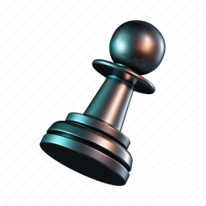

# ♟️ Chess3D

**Chess3D** is a visually immersive 3D chess game built using **Three.js**. It brings classic chess to life with modern graphics, interactive controls, and realistic 3D models — all running right in your browser.



---

## 🚀 Features

- ✅ Fully interactive 3D chessboard using **Three.js**
- ✅ Clickable tiles with dynamic highlights
- ✅ Realistic 3D models of chess pieces via `.glb`/`.gltf`
- ✅ Modular, scalable architecture
- ✅ Smooth camera movement with orbit controls
- ✅ Dynamic piece selection and move validation
- ✅ Check alerts with visual feedback

## ⚙️ Scripts

In order to run the project and perform different tasks, you can use the following npm scripts:

```json
"scripts": {
  "dev": "vite",                  # Starts the Vite development server
  "build": "vite build",          # Builds the project for production
  "start": "vite build & vite"    # Builds the project and starts the
}
```

## 📂 Project Structure

```bash
Root
├── public/
│   └── models/                # Stores 3D models of chess pieces (.glb/.gltf)
├── src/
│   ├── assets/                # Stores textures, icons, and other assets
│   ├── animate.js             # Handles piece animations and transitions
│   ├── board.js               # Creates and renders the chessboard grid
│   ├── controls.js            # Manages piece dragging and player interaction
│   ├── scene.js               # Sets up Three.js scene, camera, lights
│   ├── tiles.js               # Handles tile logic and interaction
│   ├── pieces/                # Loads and places individual chess pieces
│   │   ├── bishop.js
│   │   ├── king.js
│   │   ├── knight.js
│   │   ├── pawn.js
│   │   ├── queen.js
│   │   └── rook.js
│   ├── selectModels/          # Handles selection, highlights, and movement
│   │   ├── eventListeners.js
│   │   ├── getTopModelParent.js
│   │   ├── handleTileClick.js
│   │   ├── highlight.js
│   │   ├── highlightValidMoves.js
│   │   ├── moveModels.js
│   │   └── movePiece.js
│   ├── validatePiecesMoves/   # Valid move logic for each piece type
│   │   ├── bishop.js
│   │   ├── index.js
│   │   ├── king.js
│   │   ├── knight.js
│   │   ├── pawn.js
│   │   ├── queen.js
│   │   └── rook.js
│   ├── boardState.js          # Stores current board state
│   ├── constants.js           # Game constants (colors, piece names, etc.)
│   ├── kingInCheck.js         # Logic to detect check/checkmate
│   ├── lightning.js           # (Optional) Lightning effects or enhancements
│   ├── main.js                # App entry point, initializes everything
│   ├── index.css              # Styles for the entire game
│   └── index.html             # Web entry point
```
